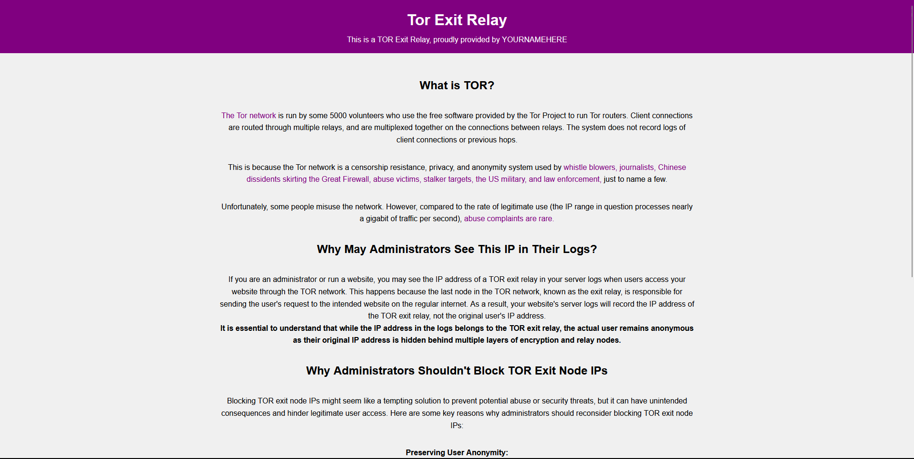

# Tor Exit Node Website Template

This project provides a simple HTML file that can be used as a website template for those who are hosting Tor exit nodes. The purpose of this template is to provide a basic website that can be easily customized to fit the needs of the user.

## Usage

To use this template, simply download the `index.html` file and replace the text "YOURNAMEHERE" with your own name or the name of your organization. You can then customize the website as needed to fit your specific needs.

## Preview

## License

This template is licensed under the Creative Commons Zero v1.0 Universal license. For more information, please see the [LICENSE](LICENSE) file.
